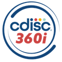

# *CDISC 360i* 

This is the CDISC 360i repository. It contains code, data files, and technical documentation for the 360i program.  

## Description
CDISC 360i is a multi-year initiative with the aim to transform the way we develop and use standards within clinical research creating connected and interoperable information  enabling automation, enhancing data integrity, and accelerating innovation.

Building on the CDISC 360 proof of concept launched a few years ago to gain community involvement, 360i (“i” for Implementation) is designed to close gaps in data standards by adding the required semantic layer to enable end-to-end automation. This initiative facilitates seamless data flow from study design through analysis, helping researchers, sponsors, and regulators drive efficiency, improve data quality, and accelerate research timelines.

### The Need for Change
Clinical research today faces significant challenges due to fragmented systems, isolated operational silos and data, and time consuming manual processes that slow decision-making, increase costs, and delay access to life saving therapies. Despite existing data standards, inconsistencies and gaps within and across the standards hinder automation, collaboration, and efficiency. As science progresses, research data and standards are becoming more intricate, and current systems and workflows struggle to keep up. This makes it harder to maintain traceability, integrate information, and respond to modern research needs.

In a time when speed, precision, and innovation are critical, the current approach simply isn’t sustainable. To advance clinical research, we must adopt a smarter, more connected approach to create a standards-driven, automated workflow that eliminates redundant, manual processes while ensuring clinical data is consistent, traceable, and reusable. By improving efficiency, consistency, and quality of data workflows, this initiative will help reduce time and costs in clinical research and position the industry to handle the growing complexity of modern trials.

### Key Benefits of a Connected Research Ecosystem: What is 360i’s Value?
- Patients: Easier access to structured, interpretable data for better engagement
- Sponsors: Protocol-driven research automating the information pipeline, reducing time to study results, and increasing quality
- Regulators: Reduced variability and clickable traceability from analysis to the collected data increasing confidence in decisions
- Researchers: Reduce barriers to entry and cost for standards through ready-to-use, implementable standards and open-source tools
- Technologists: Provide machine-readable and interoperable inputs and outputs for easier adoption by software solutions

### 360i Goals
- Define and digitalize end to end standards from study design endpoints through the analyses
- Leverage those standards to accelerate the study design and build phase of the trial
- Demonstrate the automated data flow from raw data source to the generation of the targeted result

### What will 360i Deliver?
1. Standards Packages
   - Linked and executable metadata from study endpoint through analysis
   - Includes concepts, rules, & sample data
2. Implementation Cookbooks
   -  Instructions to build standards packages
   -  Recipes to implement packages within your processes
4. Example Implementations
   - Technology-enabled example leveraging packages & recipes
   - Library of community-based open-source tools  

## Contributions

Contributions are welcome. When you contribute to this repository, you are doing so under the licenses below. Please checkout [Contribution](CONTRIBUTING.md) for additional information. All contributions must adhere to the following [Code of Conduct](CODE_OF_CONDUCT.md).

## License

 

### Code & Scripts

This project uses the [MIT](http://www.opensource.org/licenses/MIT "The MIT License | Open Source Initiative") license (see [`LICENSE`](LICENSE)) for code and scripts.

### Content

Content files, like documentation, are released under [CC-BY-4.0](https://creativecommons.org/licenses/by/4.0/). This does not include trademark permissions.

## Re-use

When you re-use the source, keep or copy the license information in the source code files. When you re-use the source in proprietary software or distribute binaries (derived or underived), copy the license text to a third-party-licenses file or similar.

When you want to re-use and refer to the content, please follow the example below:

> Content based on [Project XY (GitHub)](https://github.com/xy/xy) used under the [CC-BY-4.0](https://creativecommons.org/licenses/by/4.0/) license.
